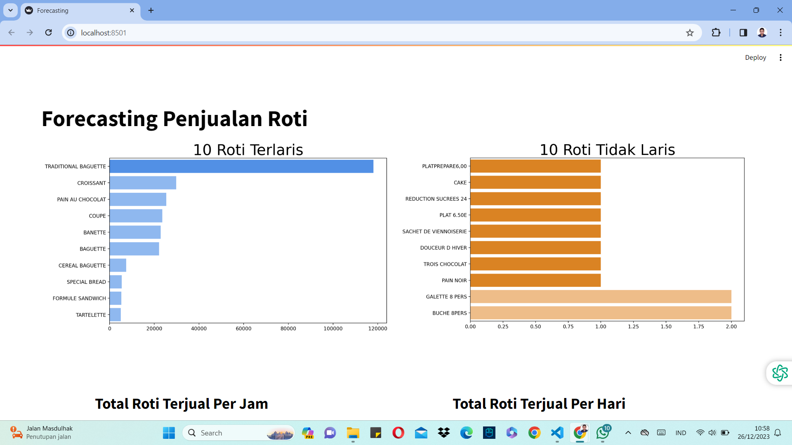
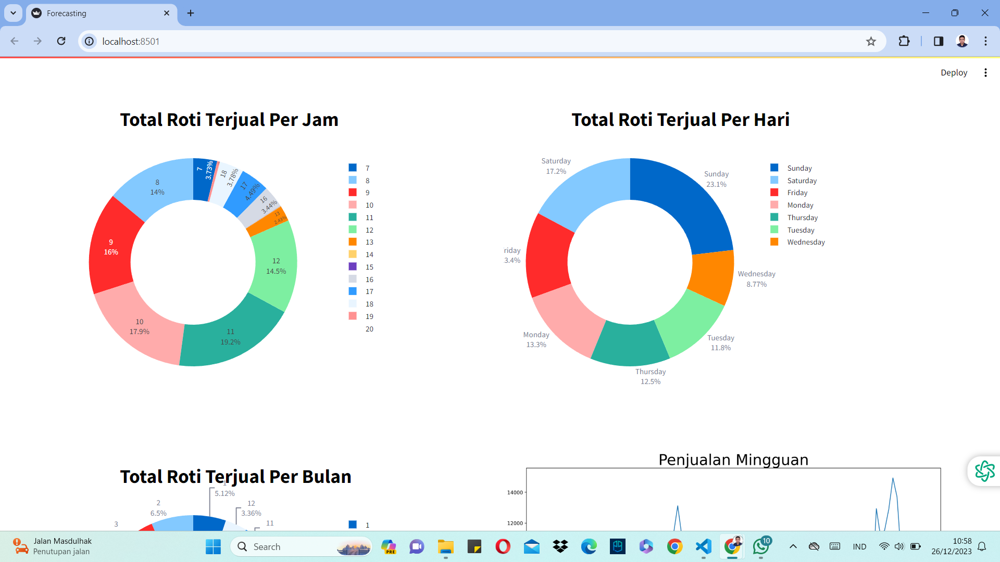
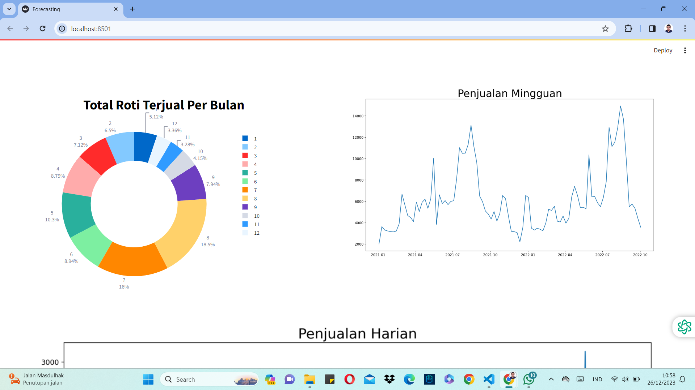
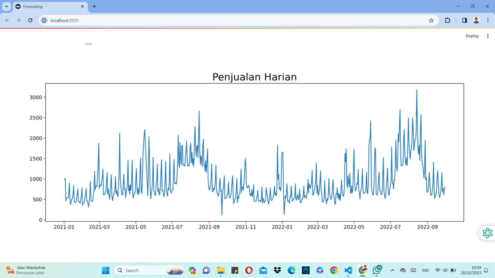
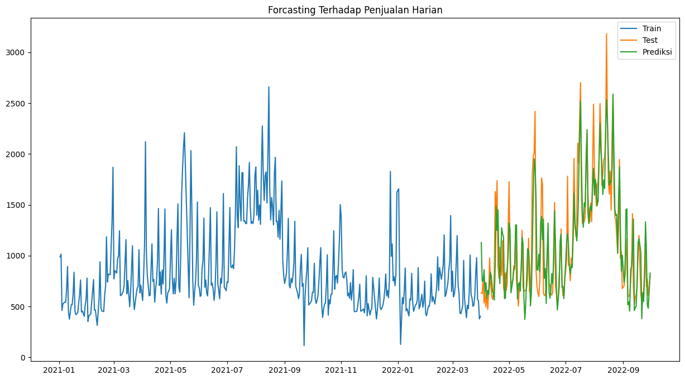

# PERAMALAN (FORECASTING) PENJUALAN ROTI

Peramalan atau forecasting penjualan roti merupakan projek untuk memenuhi tugas perkuliahan Business Intelligence. Pada projek ini saya mengembangkan dashboard menggunakan streamlit dan meramalkan penjualan roti di masa datang menggunakan algoritma ARIMA. Dataset tersebut dapat dilihat pada link berikut ini : [KLIK DISINI](https://www.kaggle.com/datasets/matthieugimbert/french-bakery-daily-sales/data)

## Mulai Bekerja

1. Kloning Repositori ini

```
https://github.com/iqbalpurba26/Forecasting-Penjualan-Roti.git
```

2. Persiapan Lingkungan

```
python -m venv env
env\Scripts\activate.bat
pip install --no-cache-dir -r requirements.txt
```

3. Jalankan Aplikasi Streamlit

```
streamlit run dashboard.py
```

## Screenshot Hasil Dashboard






## Screenshot Hasil Forecasting


